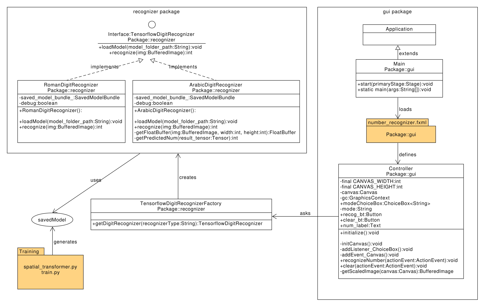
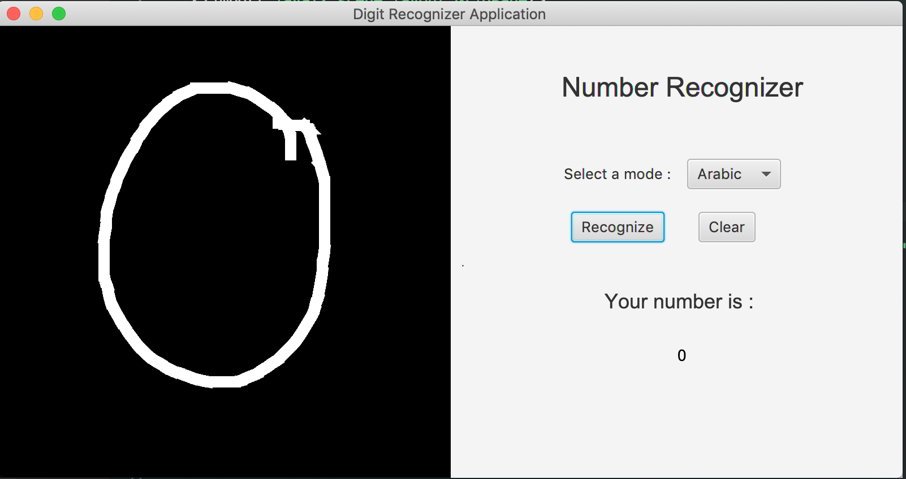
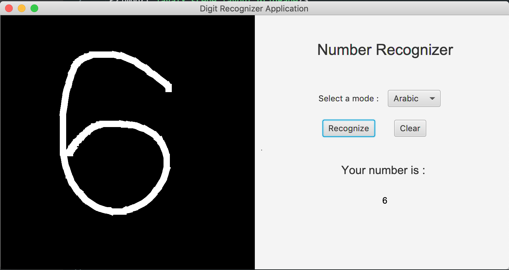

# Description
A number recognizer that reads in the drawed digit in the canvas and output the recognition result.

The project is composed of a GUI written using JavaFx library, and a model training pipeline written in python. The model training(train.py) is a five layer neural network utilizing a spatial transformation library from Tensorflow as one of the layers. The motivation for using spatial transformation is to make the result robust to any spatial movements of the object (e.g. horizontal move, rotation). The data for training is MNIST dataset.

# Project Organization
The code is stored in /src directory, and documentation in /Documentation library. The trained model is under /src/model* with different folders for different batch size.
The documentation contains the requirements of the project, a class design of the project, and the test screenshots.

# Class Organization
{width=65%}

# Sample Screenshots

